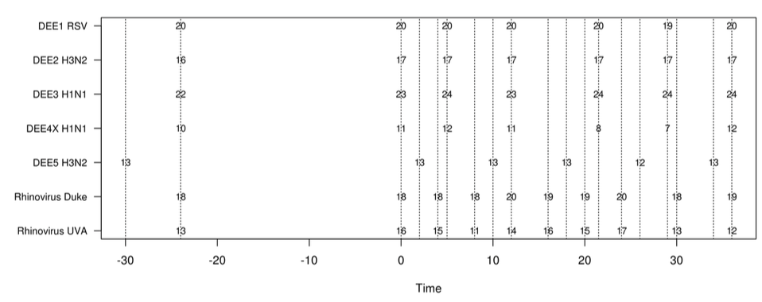

#1.0 Our Goal For Today

The goal of today's workshop is to examine a set of genes across a number of cohorts for Dream Challenge Dataset. We will examine the subsetted data using the visualization framework built in R called Shiny and ask the question: Do we think there is enough signal in the exposure data to warrant further study of this dataset? Do we believe that our data can predict the outcomes for this dataset?

In order to do so, we'll first need to explore the data format and explore the data at three levels:

1. Summary Level (compared across studies)
2. Single gene level (with multiple patients)
3. Aggregated pathway level ()

##1.1 Study Design

The goal of the DREAM challenge is to use the microarray data provided to predict two different functional outcomes: 1) Whether virus shedding was detected in a swab after exposure and 2) Whether multiple viral symptoms were observed.

In this dataset for the [DREAM Respiratory Virus Challenge](https://www.synapse.org/#!Synapse:syn5647810) there are seven studies in total with the following characteristics. The most important is the Duke Rhinovirus dataset, which contained patients who were exposed to Rhinovirus (notated as `rhino`) and patients who were exposed to a control (annotated as `SHAM`).  We will only examine two of the studies: the Duke Rhinovirus study and the DEE3 H1N1 study (annotated as `DEE3 H1N1`).



Basically, for most of the timepoints and for most of the patients within a study, we have a microarray measurement. Note that some patients are missing certain timepoints, which complicates our analysis. 

The set of 20,000 probesets from the Affymetrix U133 2.0 microarray were mapped to the gene identifiers (in this case Gene Symbols) using the `hgu133plus2.db` annotation package and filtered using the following approach: Coefficients of Variation for the Sham (non exposed) patients at all timepoints were compared to the CVs for those patients exposed to Rhinovirus. The thought behind this is that genes of interest should show more variability (due to the time-series design) in the Rhinovirus patients than the sham patients.

Based on visualizing the distributions of CVs, a cutoff of `cvRhinovirus/cvSham` > 1.4 was used, leading to a set of 836 genes that had higher observed variability in the Rhinovirus compared to Shams. We'll be visualizing this much smaller set across multiple patients, diseases, and time points.

##1.2 Before You Get Started

Please make sure that you have the following packages installed before you proceed.

```{r eval=FALSE}
library(data.table)
library(ggplot2)
library(shiny)
```

Clone the repo into a directory. If you are using the GitHub desktop client, you will need to go to the webpage for the repo (https://github.com/laderast/DreamEDAShiny) and select ">>Clone or Download >> Open in Desktop". If you are on the command line, you can use the following command.

```{eval = FALSE}
git clone https://github.com/laderast/DreamEDAShiny
```

When you have cloned the repo, open the `DreamEDAShiny.Rproj` in RStudio (Use **File >> Open Project** to open it.)

#2.0 Examining the Rhinovirus Data

In this section, we'll examine the subsetted data in order to understand its format and learn some more about the `data.table` package, which we'll use to store the data in memory. In case you are interested in learning more, there is another document `introToDataTable.Rmd` that introduces you to the basics of `data.table`.

##2.1 Looking at the data objects

All of the data that we're using is in the `/data/twoStudies.RData` object. Let's look at the format of the data. Let's start by looking at the data objects in the `RData` file:

```{r}
#load the data up
library(data.table)
load('data/twoStudies.RData')

#list the objects
ls()
```

Look at the `viralData` table. How big is the data set (how many rows)? Which column has the expression value? Take a look at the `dataDescription.pdf` in the main directory of the repo. What do the other columns correspond to? What are our outcome variables that we want to examine?

Both the `viralData` and the `averageProfiles` are in the `data.table` format, which is a more sophisticated version of `data.frame`. The main advantage is that working with `data.table` is very fast and is optimized for working with very large datasets (on the order of millions of rows). The main disadvantage is that the syntax is slightly different than `data.frames`.

```{r}
viralData
```

The `viralData` is in what's called `long` format, where each observation (in this case, a microarray value for a probeset) is on its own line, accompanied by its metadata. This long format is what multiple packages, such as `dplyr` and `ggplot2` (which we use in this workshop) expect. We'll examine a method to `cast` (transform) the data into a `wide` matrix format later.

```{r}
#look at the averaged profiles
averageProfiles
```

How does the `averageProfiles` table differ from the `viralData` profile? What aspect of the data did we average over?

The last object we have in the `RData` file is the `pathways` object. This is a list of pathways from the Reactome database that the 836 genes that we have selected are overrepresented in. Note that this data object only includes genes in our set that map to our gene set of interest, not the entire pathway.

```{r}
#show first 5 pathways
pathways[1:5]
```

We can use `pathways` to subset the data. We'll use this when we start visualizing the data. Notice that we don't have to use `viralData$geneSymbol` when we subset, and we don't need to specify a comma.

```{r}
#grab the first pathway - `Regulation of IFNA signaling`

pathway <- pathways[[1]]
pathway

#compare the subsetting to the data.frame way of subsetting:
#viralData[viralData$geneSymbol %in% pathway,]

viralData[geneSymbol %in% pathway]
```

#3.0 Visualizing the Viral Dataset using Shiny

Now that we are familiar with the data format, let's start exploring the data set. Open the `global.R` file in the top folder and hit the "Run App" button in the top right corner of the script window to load the Shiny interface. 

##3.1 The Summary Tab

Take a look at the `Summary` tab. What does it tell you about the data?

When you are done, take a look at `ui.R`. How was the summary tab defined in the code? How did we specify the elements of the summary tab?  

After that, take a look at `server.R`. Where did we define the plot and summary contents? How did we plot the boxplots?

**Discussion Points**

1) Are the values from the different studies (Rhino, Rhino-SHAM, and DEE3 H1N1) comparable? Are there any observable batch effects between studies?

2) How many different timepoints are there? How do the demographics vary across datasets? You will probably have to examine the `viralData` object and do some exploration (hint: the `table()` function is very helpful here).

##3.2 The Gene Explorer Tab

Now take a look at the `Gene Explorer` tab. Select a gene of interest. What does each trace correspond to?

Look at `ui.R`. How did we specify the list of genes? Where did this list of genes come from? (Hint: take a look at `global.R`.)

Look at the appropriate plotting code in `server.R`. How did we build the plot? What aesthetics (x, y, fill, etc.) did we map to? 

Uncomment the code in `server.R` for conditioning the plots. What are we conditioning the plot on? Does it make the plot more understandable? How did we condition the plot? How would we condition on a different variable? 

**Discussion Points**:

1. How much variability do we observe between the different studies? 
2. Are there any genes that show interesting traces?

##3.3 The Pathway Explorer Tab

Take a look at the `Pathway Explorer` tab. Select a pathway. What does each trace correspond to?

Similar to 3.1 and 3.2, take a look at `ui.R` and `server.R`. Understand how we generated the plot. Uncomment the code to condition the plot. 

**Discussion Points**:

1. Are the traces similar in trend for any pathway?
2. What about the variability associated with a gene trace? Is the variability more within a study or between the studies?
3. What are the potential pathways of interest?

#4.0 Discussion Time (Halfway Point)

We'll take a quick break when everyone is finished with task 3 and discuss the dataset. Here are some potential discussion points:

1. What is your interpretation of the gene level versus pathway level? 
2. What did you get and not get from examining the data? 
3. What would you be interested in conditioning the plots on? Demographics/Outcomes?
4. Do you think this dataset is worth using in the DREAM challenge? What more information do you need?

#5.0 Modifying the code

There are lots of directions that we can take to modify the code. We can condition plots on outcomes. We can condition the plots on demographics. I outline some specifics here.

##5.1 Conditioning on `GENDER` and Outcome

What if we were interested in gender specific differences? How could we condition our gene visualization on it? (If you are confused, please consult `help(facet_grid)`)

How could we condition the plots on both `STUDYID` and an outcome variable, such as `SHEDDING_SC1`? (Hint: look at `help(facet_grid)`). Do you notice any differences? (Hint: you might want to put make the x-axis facet `SHEDDING_SC1` and the y-axis facet `STUDYID` so you can visually compare the differences.)

##5.2 Binning the data and conditioning on it

We can use the `ifelse()` function to do some quick binning of the age data. Let's bin the `AGE` column and add a new column called `ageBin`. We'll assign a value to of 1 if AGE < 25, and 2 otherwise.

```{r}
#This code is really confusing at first glance.
#We are defining a new column called "ageBin" into the viralData using the 
#":=" operator
#note that data.table calculates the new column in place, which means we don't need the "<-"
#operator

viralData[,ageBin := ifelse(AGE < 25, 1, 2)]

#show that we've added this column.
viralData
```

If we wanted to add this column to the application, where would we add this code? How could we condition the plots based on this?

#5.3 Adding a new tab/visualizations

The genes used in this dataset come from Reactome Pathways. What if we took the 836 genes (also available in `old/genes.txt`) in our set and did a GO enrichment analysis? How could we visualize these results?

If you want to add another tab, you will need to add another `tabPanel` in `ui.R` and a plot in `server.R`. 

#5.4 Integrate More Complex Outcomes

The multi-symptom outcomes are available for each patient in the following file below. What do we need to do to merge this information in with our data?

```{r}
SymptomScores <- fread("data/ViralChallenge_training_SymptomScoresByDay.tsv")

SymptomScores
```